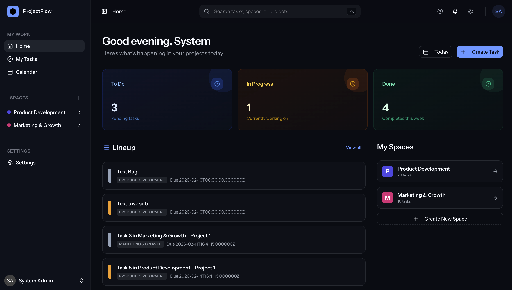
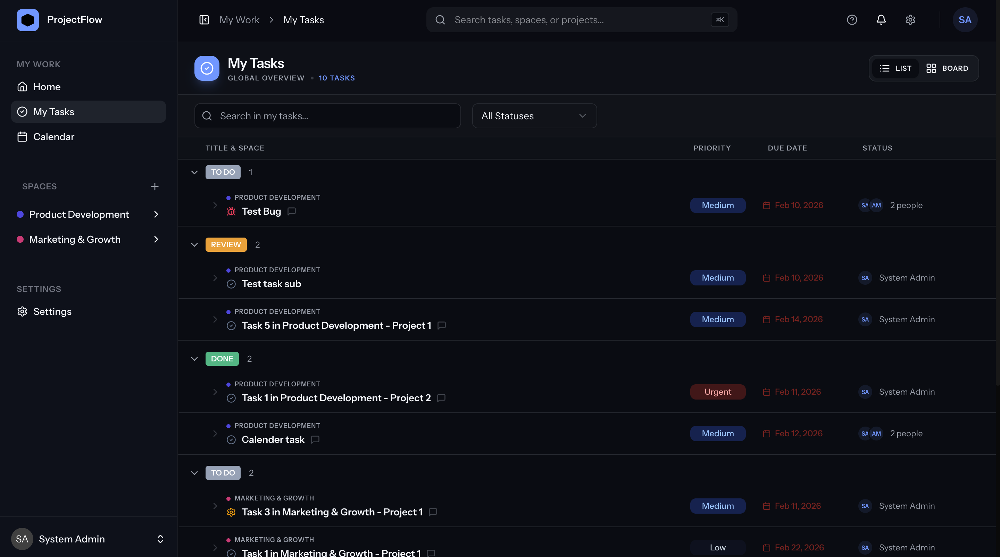

# Project Flow

A self-hosted project management application built with Laravel, Inertia.js, and React. Organize work into spaces, projects, sprints, and tasks — with real-time updates, team collaboration, and email notifications.

**[Live Demo →](https://project-management-develop-lxzqbj.laravel.cloud/)**

## Screenshots

| Dashboard | My Tasks |
|---|---|
|  |  |

## Features

- **Spaces** — Top-level workspaces to group projects by team or organization
- **Projects** — Organize tasks within a space
- **Tasks** — Rich tasks with subtasks, comments, mentions, status, priority, and type
- **Sprints** — Plan and track work in sprints; archive completed ones
- **Real-time** — Live updates via Laravel Reverb (WebSockets)
- **Notifications** — Email notifications for task creation, status changes, and @mentions
- **Invitations** — Invite team members to spaces via email
- **Activity Log** — Full history of changes per task
- **My Work** — Personal view of tasks assigned to you

## Tech Stack

- **Backend:** PHP 8.4, Laravel 12, Laravel Fortify, Spatie Permissions
- **Frontend:** React 19, Inertia.js v2, Tailwind CSS v4, Radix UI
- **Real-time:** Laravel Reverb
- **Database:** MySQL
- **Queue:** Laravel Queue (database driver)
- **Testing:** Pest v4

## Requirements

- PHP 8.4+
- Node.js 20+
- MySQL 8+
- [Laravel Herd](https://herd.laravel.com) (recommended) or any local PHP server

## Installation

```bash
# Clone the repository
git clone https://github.com/naveenprasath-dev/project-management.git
cd project-management
```

Copy `.env.example` to `.env` and configure your database and mail settings:

```bash
cp .env.example .env
```

Update the following in `.env`:

```env
APP_URL=http://project-management.test

DB_CONNECTION=mysql
DB_HOST=127.0.0.1
DB_PORT=3306
DB_DATABASE=project_flow
DB_USERNAME=root
DB_PASSWORD=

MAIL_MAILER=smtp
MAIL_HOST=
MAIL_PORT=
MAIL_USERNAME=
MAIL_PASSWORD=
MAIL_FROM_ADDRESS="hello@example.com"

REVERB_APP_ID=
REVERB_APP_KEY=
REVERB_APP_SECRET=
```

Generate Reverb credentials:

```bash
php artisan reverb:install
```

Then run the setup script (installs dependencies, generates app key, runs migrations, and builds assets):

```bash
composer run setup
```

## Seeding Demo Data

The project ships with a seeder that creates a realistic starting state — useful for exploring the app or understanding the data model before building on top of it.

```bash
php artisan db:seed
```

This runs the following seeders in order:

| Seeder | What it creates |
|---|---|
| `RoleAndPermissionSeeder` | `admin` and `member` roles with their permissions |
| `ProjectManagementSeeder` | Demo users, spaces, projects, and tasks |

**What gets created:**

- **3 users** — an admin and two members
- **2 spaces** — "Product Development" and "Marketing & Growth", each with all three users as members
- **4 task statuses per space** — To Do, In Progress, Review, Done
- **2 projects per space** (4 total) — each with all members assigned
- **5 tasks per project** (20 total) — randomly distributed across statuses, priorities, and assignees

**Demo credentials:**

| Role | Email | Password |
|---|---|---|
| Admin | `admin@example.com` | `password` |
| Member | `alice@example.com` | `password` |
| Member | `bob@example.com` | `password` |

> If you want a fresh start, run `php artisan migrate:fresh --seed` to drop all tables, re-run migrations, and re-seed in one step.

## Running Locally

```bash
composer run dev
```

This starts the Laravel server, queue worker, log watcher, and Vite dev server concurrently.

## Testing

```bash
php artisan test --compact
```

## Code Style

```bash
vendor/bin/pint
```

## Contributing

1. Fork the repository
2. Create a feature branch (`git checkout -b feature/my-feature`)
3. Follow existing code conventions — PSR-4, strict types, Pest for tests, Pint for formatting
4. Run tests before submitting (`php artisan test --compact`)
5. Open a pull request

## License

MIT — see [LICENSE](LICENSE).
